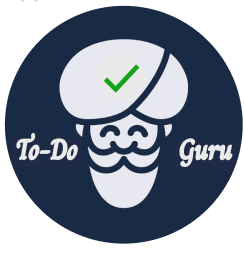
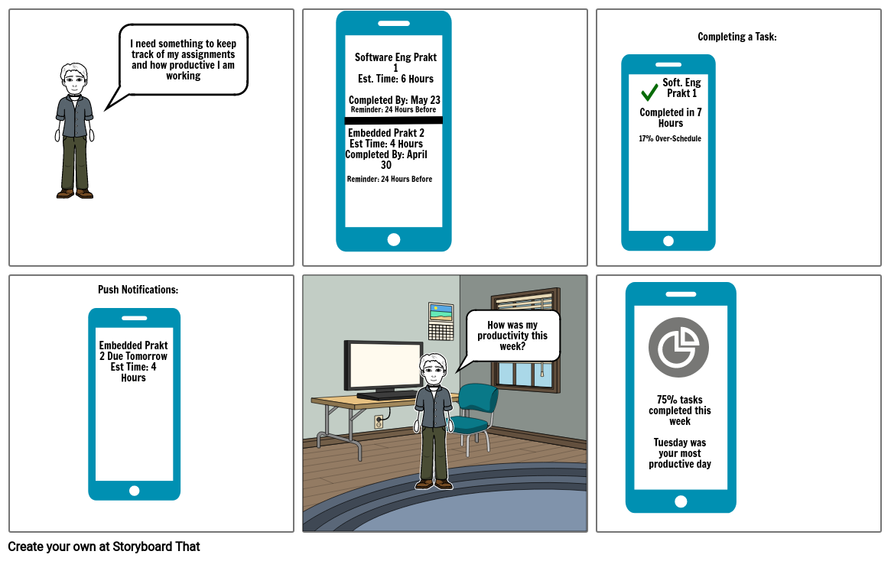
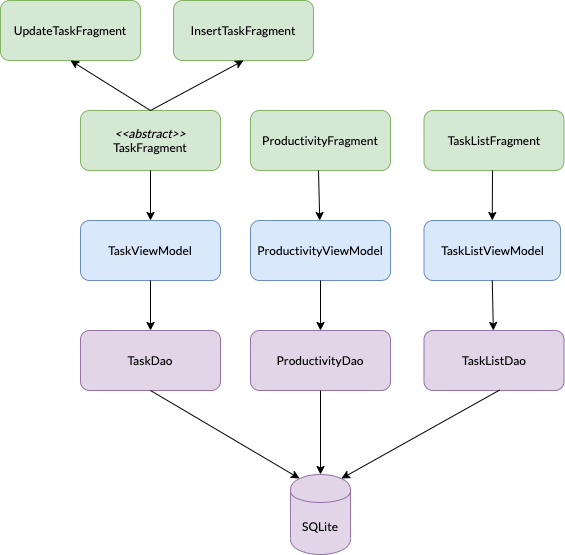
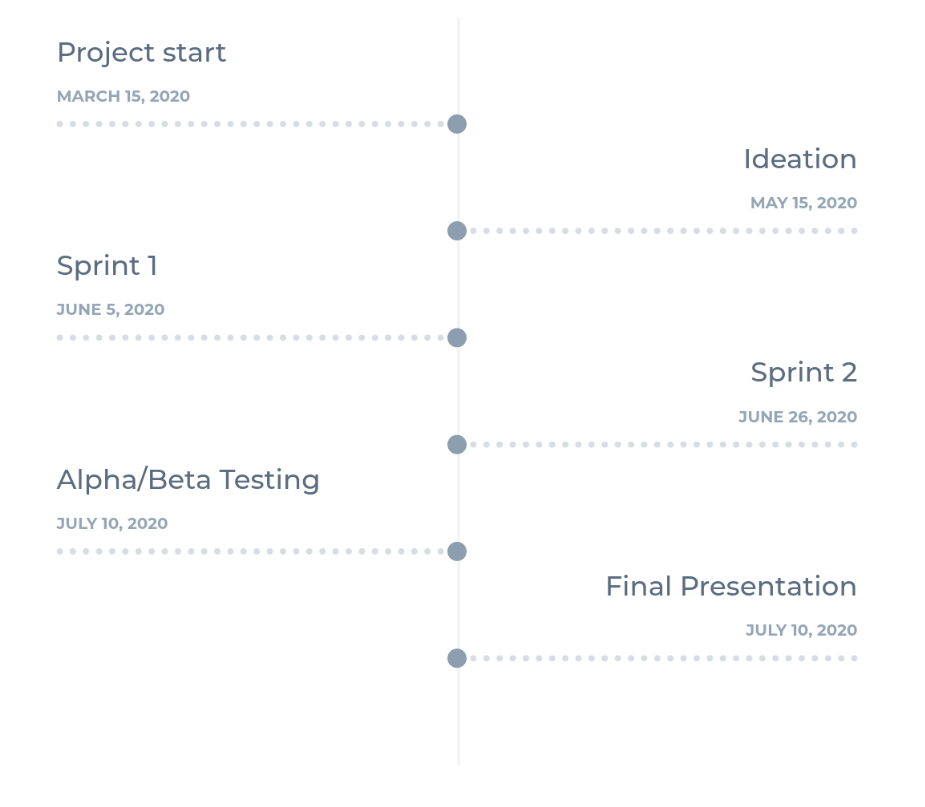

# ToDo Guru


ToDo Guru will help make your life more productive by organizing your tasks and reminding you when certain tasks should be worked on and completed.


## Concept
The concept of the app is that it helps you to keep track of your tasks. It reminds you constantly that you have tasks that are not already done to improve your productivity and it also shows you tasks you already finished, to keep you motivated.

### Storyboard

### Prototype
* [Overview on Figma](https://www.figma.com/file/XoVCNBGzGf3GtRMCQAQIDV/prototype?node-id=0%3A1)
* [Interactive showcase on Sketch](https://www.figma.com/proto/XoVCNBGzGf3GtRMCQAQIDV/prototype?node-id=0%3A1823&scaling=min-zoom)
* [Overview on Figma](https://www.sketch.com/s/b24594e7-bbed-4fd7-af92-4ea9c37969a1)
* [Interactive showcase on Sketch](https://www.sketch.com/s/b24594e7-bbed-4fd7-af92-4ea9c37969a1/a/QqywbY/play)


## Architecture
### Dependencies
* Android Navigation 
* Material Design
* Room Database with Android Lifecycles
* Kotlin Co-Routines
* Gson
* ktlint
* Android Junit & Espresso Testing
* Google Analytics & Crashlytics --> You need at least access to the Google Firebase console. To get access contact Michael Fuchs

### Architecture


### Project Structure
```
todoguru/
├── database/
│ // Database, database DAOs and entities
├── explanation/
│ // Fragments for explanation pages
├── notification/
│ // Notification for reminder
├── privacy/
│ // privacy policy
├── productivity/
│ // all about the productivity
├── task/
│ // All about the actual tasks
│ ├── categories/
│ │ // Adapter, fragments and ViewModel for using categories
│ ├── completedTask/
│ │ // Adapter, fragments and ViewModel for displaying completed tasks
│ ├── delete/
│ │ // Dialogs for deletion of categories, tasks and subtasks
│ ├── insert/
│ │ // Dialogs for insertion of categories, tasks and subtasks
│ ├── list/
│ │ // Adapter, fragments and ViewModel and Wrapper for using categories
│ ├── read/
│ │ // Fragment to view Task
│ ├── subtask/
│ │ // Adapter, fragments and ViewModel subtasks
│ ├── timeTracker/
│ │ // ViewModel for tracking time on task
│ ├── update/
│ │ // Fragment for updating task
│ ├── SetAlarmDialog.kt
│ │ // Dialog for setting alarm
│ ├── SetCategoryDialog.kt
│ │ // Dialog for setting categories
│ ├── SetReminderFragment.kt
│ │ // Fragment for reminder
│ ├── SetRepeatDialog.kt
│ │ // Dialog for setting task on repeat
│ ├── TaskFragment.kt
│ │ // Fragment for tasks
│ ├── TaskViewModel.kt
│ │ // ViewModel for tasks
│ └── Util.kt
│ // For displaying the tracked time on task
├── BindingUtils.kt
│ // Factory to create specified viewModels
└── MainActivity.kt

```

## Tools
 [](https://codecov.io/gh/mobileappdevhm20/team-project-team_4) [](https://sonarcloud.io/dashboard?id=mobileappdevhm20_team-project-team_4) [](https://github.com/mobileappdevhm20/team-project-team_4/blob/master/LICENSE)
* CI-Pipeline was built with [GitHub Actions](https://github.com/mobileappdevhm20/team-project-team_4/actions)
* Dependencies will be automatically updated with [renovatebot](https://app.renovatebot.com/dashboard#github/mobileappdevhm20/team-project-team_4)
* The code coverage will be automatically determined on each pull request via [codecov.io](https://codecov.io/gh/mobileappdevhm20/team-project-team_4)
* The code quality will also be automatically checked with [sonarcloud.io](https://sonarcloud.io/organizations/mobileappdevhm20/projects) and [ktlint](https://github.com/pinterest/ktlint) on each pull request


## Development


### Feature State
You can check all [implemented features](https://github.com/mobileappdevhm20/team-project-team_4/issues?q=is%3Aissue+is%3Aclosed) out. Also there are [features](https://github.com/mobileappdevhm20/team-project-team_4/wiki/Use-Cases) that have been determined, but they haven't been implemented yet ([All other features](https://github.com/mobileappdevhm20/team-project-team_4/issues)).

## Learnings
* Learned how to work in a team in an agile way.
* Learned how to structure a project in github.
* Learned Kotlin in general and Android Studio in general.
* Issue dependency can lead to big problems in development if it is not considered. There should be someone that has an overview of the issues and make sure that certain issues are done first in order to minimize wait time between issues.
* Releasing and publishing apps with Firebase and the Goolge Playstore.
* Different styles of architectures.
* Working in a very remote team with the agile way.
* Communication is key!
* Use everyones strengths and be aware of there weaknesses.
* meeting regularly in team helps a lot.


## Links
* [Sprint 2 Presenation](https://docs.google.com/presentation/d/1onptqqwC0zfsclfpvAKzEf4_YOFf-ZvH7bKNGJNikvA/edit?usp=sharing)
* [Sprint 3 Presenation](https://docs.google.com/presentation/d/1HmiV4ydcXIB96d2ua-lohfKKjHxyVI61lJSczTgyQ7w/edit?usp=sharing)
* [Privacy Policy](privacy.html)
* [Terms & Conditions](terms_and_condition.html)
